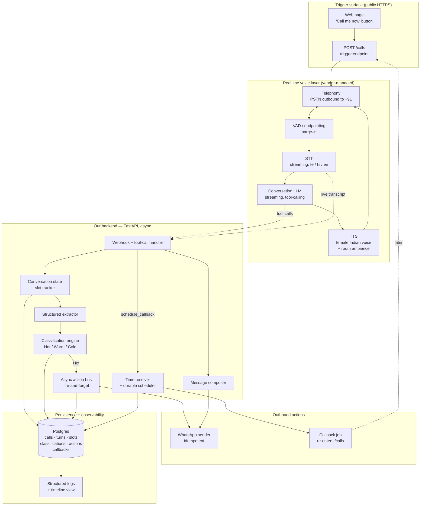

# System Design — AI Voice Sales Agent

Companion to [`requirements-analysis.md`](requirements-analysis.md). Requirement IDs (FR-xx / NFR-xx / M-xx / I-xx) refer to that document.

**Design goal, in priority order:** (1) a call that connects and holds a real conversation, (2) correct intent reading, (3) actions that fire while the call is live, (4) a follow-up that quotes the lead, (5) an architecture we can defend in a 10-minute conversation. Everything else is subordinate.

---

## 1. Architecture at a glance



**The one structural idea worth defending:** the **speech loop is never blocked by a decision or an action**. STT → LLM → TTS runs at conversational speed; a parallel *understanding lane* (extract → classify → act) consumes the same live transcript and fires side effects independently. That single split is what makes NFR-01 (latency), NFR-03 (non-blocking mid-call actions), and FR-09 (WhatsApp before the call ends) simultaneously achievable.

---

## 2. Components

| # | Component | Responsibility | Serves |
|---|-----------|----------------|--------|
| C1 | **Trigger surface** | Public page + `POST /calls`. One button, no install. Also the callback job's entry point. | FR-02, NFR-09, I-01, I-02 |
| C2 | **Telephony** | Places the PSTN call to +91, streams audio both ways, reports answer / no-answer / voicemail / hangup. | FR-01, I-08 |
| C3 | **Realtime voice orchestrator** | VAD, endpointing, barge-in, STT streaming, LLM streaming, TTS streaming, background ambience. Vendor-managed. | FR-16, NFR-01, NFR-02, NFR-05, NFR-06 |
| C4 | **Speech-to-text** | Live transcription in Telugu / Hindi / English, ideally with per-utterance language identification. | FR-03, FR-04 |
| C5 | **Conversation LLM** | Runs the sales conversation. Owns the persona, the pitch, the discovery order, the language mirroring, and the *foreground* tool calls. | FR-05, FR-06, FR-03 |
| C6 | **Text-to-speech** | Female Indian voice, natural in whichever language the turn is in. | NFR-05, NFR-06 |
| C7 | **Webhook / tool-call handler** | The single ingress from the voice layer: transcript deltas, tool calls, status events. Answers tool calls in <300 ms by delegating to the bus. | NFR-03 |
| C8 | **Conversation state / slot tracker** | Authoritative record of which of the 5 discovery slots are filled, with what, and from which utterance. Injected back into the LLM each turn. | FR-06, I-04 |
| C9 | **Structured extractor** | Turns free speech into typed fields (budget, products, product_count, timeline, features, barrier, quotable phrases). Runs async per turn. | FR-07, FR-13, I-05 |
| C10 | **Classification engine** | Hot / Warm / Cold + confidence + barrier + evidence quote, recomputed on every meaningful turn. Async, off the speech path. | FR-08 (15 pts) |
| C11 | **Action bus** | Fire-and-forget dispatch with idempotency keys, retries, and a per-call action ledger. | FR-09, I-07, NFR-03 |
| C12 | **WhatsApp sender** | Sends templated + media messages; records sent/delivered timestamps. | FR-09, FR-11, FR-14, FR-15 |
| C13 | **Time resolver** | Spoken time → concrete `Asia/Kolkata` datetime, including vague phrasing, with a stated convention. | FR-12 (10 pts), I-12 |
| C14 | **Durable scheduler** | Persists callbacks and actually re-triggers `POST /calls` at the right moment; survives restarts. | FR-12, I-06 |
| C15 | **Message composer** | Writes the mid-call and post-call WhatsApp copy from real extracted content, with a pre-send quality gate. | FR-13, FR-14 (10 pts) |
| C16 | **Persistence** | Postgres. Calls, turns, slots, classification history, actions, callbacks, media. | I-03 |
| C17 | **Observability** | Structured JSON logs + a per-call timeline view showing every turn, extraction, classification change, and action with timestamps. | NFR-07, NFR-08, I-14 |
| C18 | **Reconciliation sweeper** | Periodic job: any call ended >2 min ago without a post-call message gets one. | I-13, NFR-07 |
| C19 | **Media host** | Public URLs for the architecture image, resume PDF, and Cold-lead brochure. | I-10 |

---

## 3. Call flow, end to end

### 3.1 Before the call
1. Evaluator opens the public URL (or the callback job fires) → `POST /calls`.
2. Backend creates a `call` row (`status=initiating`), generates a correlation ID, seeds the slot tracker empty.
3. Backend asks the voice orchestrator to dial +91 8688664337 with the assistant config: system prompt, tool schemas, STT/TTS providers, ambience, and our webhook URL carrying the correlation ID.
4. Backend returns immediately. The page polls `GET /calls/{id}` for live status.

### 3.2 During the call — the two lanes

**Speech lane (must stay under ~1.2 s per turn):**
```
lead speaks → VAD endpoint → STT partial+final → LLM streams tokens → TTS streams audio → lead hears
                    ↑                                                                        │
                    └──────────────── barge-in cancels TTS mid-sentence ─────────────────────┘
```

**Understanding lane (runs in parallel, never blocks the above):**
```
final transcript turn ──► webhook ──► persist turn
                                  ├─► extractor  ──► update slot tracker ──► persist
                                  └─► classifier ──► Hot/Warm/Cold + barrier + evidence
                                                          │
                                          ┌───────────────┼────────────────┐
                                     Hot? │          Warm? │           Cold? │
                                          ▼                ▼                 ▼
                                   fire mid-call     capture barrier,   queue brochure
                                   WhatsApp NOW      drive to callback
```

**Two independent paths to the mid-call WhatsApp (deliberate redundancy on a 15-point row):**
- **Path A — foreground tool call.** The conversation LLM is given a `send_details_now` tool and instructed to call it the moment the lead asks for details, pricing, or a start date. **Use a non-blocking/background tool where the orchestrator supports one** — a *synchronous* tool call stalls the agent's turn by the full round trip however fast our handler is (audit Finding D). Where only synchronous tools exist, the handler enqueues and returns `{"ok": true}` in under 300 ms so the LLM's next sentence can acknowledge it naturally.
- **Path B — background watchdog.** The async classifier fires the same action if it reads Hot and Path A has not already fired within one turn. Same idempotency key, so at most one message goes out.

Path A gives the natural verbal acknowledgement ("sent it to your WhatsApp just now — you should see it"). Path B guarantees the 15 points even if the LLM fails to call the tool. Neither can double-send.

**Callback path:** LLM calls `schedule_callback(spoken_time_phrase)`. The handler resolves it synchronously (it is fast and deterministic), returns the resolved human-readable datetime in the tool result, and the LLM says it back for confirmation — *"Perfect, so tomorrow morning, Friday the 28th, around 10. I'll ring you then."* The row is persisted and a durable job registered.

### 3.3 After the call
1. `call.ended` webhook → persist final transcript, duration, end reason.
2. Final extraction + final classification over the complete transcript.
3. Composer writes the follow-up: greeting, 3–5 specifics from the slots, one near-verbatim quote, next step, mobile number on its own line.
4. **Quality gate** before sending: assert ≥3 extracted values present, ≥1 quoted phrase present, mobile number present, length within template limits. Fail → regenerate once → fail again → send a safe fallback and log loudly.
5. Send: primary message (architecture image + context + number), then the resume document.
6. Sweeper double-checks 2 minutes later.

---

## 4. Technology decisions

Every row below states *why*, and what was rejected and on what grounds. The assignment is explicit that no stack scores points by itself — so each choice is justified by time-to-working-call, latency, Telugu capability, or debuggability.

### 4.1 Realtime voice orchestration — **Vapi** (primary), Retell (fallback)

**Why:** it collapses the hardest 25 points into configuration. Sub-second turn latency, production-grade barge-in and endpointing, provider-agnostic STT/TTS slots (so we can swap in whatever wins the Telugu bake-off), first-class **server-side tool calls with a webhook** — which is exactly the mid-call action mechanism FR-09 needs — plus recordings, live transcript events, and call status webhooks for free. It also supports a background-ambience setting, which the assignment explicitly hints at (NFR-06).

**Rejected:**
- **Raw telephony media streams + our own STT/LLM/TTS pipeline.** Maximum control and the best story, but barge-in, endpointing, jitter buffering, and interruption recovery are roughly two weeks of tuning to reach a quality the vendors ship by default. The assignment rewards a working call this week. This is the honest answer to "what would you build next" if we had more time.
- **Retell.** Very close substitute; kept as the fallback if Vapi's India termination or Telugu provider options disappoint. Decide on spike evidence, not preference.
- **Bland.** More vertically integrated, less freedom to choose the STT/TTS provider — and provider choice is precisely where Telugu is won or lost.
- **OmniDimension** (suggested in the brief). Worth a spike specifically because the evaluator named it, which tells us they consider it adequate. Evaluate on the same criteria; adopt if it wins.
- **Speech-to-speech models (OpenAI Realtime / Gemini Live).** Lowest possible latency and inherently good at code-switching, since one model hears and speaks. Two reasons it is not the primary: Telugu *output* quality is the unknown that decides 10 points, and we would lose the clean per-turn text transcript that the classification lane (15 pts) and the composer (10 pts) both consume. Keep as a live alternative if the Telugu bake-off favours it.

### 4.2 Telephony to +91 — **decide by spike, Twilio as the working assumption**

This is the **single highest-risk external dependency** and the reason Phase 0 exists. Outbound VoIP to Indian mobiles is subject to carrier filtering, caller-ID trust issues, and provider-side geo-permission settings; answer rates and audio quality vary by route in ways no documentation predicts.

**Candidates to spike, in order:** Vapi-provided numbers → Twilio (BYO into Vapi, geo-permissions for India enabled) → Plivo (stronger India routing) → an Indian CPaaS (Exotel / Ozonetel / Knowlarity, best local termination but multi-day KYC onboarding).

**Decision rule:** whichever route gives us a connected, clean-audio, low-latency call to our own +91 mobiles on ≥8 of 10 attempts wins. This is measured, not chosen. Start the Indian-CPaaS KYC in parallel on day one as insurance, since its lead time is external.

### 4.3 Speech-to-text — **bake-off, weighted entirely on Telugu**

Hindi and English are solved by every serious vendor. Telugu is not, and it is where the 10-point language row is decided. Committing without measuring would be exactly the kind of brand-driven choice the assignment warns against.

**Candidates:** **Sarvam (Saarika)** — an Indian provider built specifically for Indic languages and code-mixed Indian speech, the strongest a-priori fit; **Google Cloud STT** (`te-IN`, `hi-IN`, mature, streaming, reliable); **Soniox** (named in the brief, strong multilingual streaming); **Deepgram** (excellent latency, but Indic coverage is the question, so it is Hindi/English insurance rather than a Telugu answer); **ElevenLabs Scribe** (strong accuracy, streaming maturity is the question for a live call).

**Measured on:** word error rate on ~30 recorded utterances per language including code-mixed sentences, streaming partial latency, and whether it reports per-utterance language ID (which C8's language locking wants).

### 4.4 Text-to-speech — **bake-off, same weighting**

**Requirements:** female Indian voice (NFR-06), natural in Telugu specifically, low time-to-first-byte, and ideally *one speaker identity across all three languages* so a code-switched sentence does not change voice mid-sentence.

**Candidates:** **Sarvam (Bulbul)** — Indic-native, single-speaker multilingual, the best structural fit for code-switching; **ElevenLabs Flash** — best-in-class naturalness and very low latency, Telugu quality is the open question; **Azure Neural** (`te-IN` voices) — reliable and unexciting, a safe floor; **Google Cloud TTS** — same role.

**Measured on:** native-speaker naturalness rating on the same sentence set, TTFB, and behaviour on a mixed Telugu-English sentence.

**Rejected:** voice cloning (O-07 — marginal gain over a good stock voice, real time cost).

### 4.5 Conversation LLM — **Claude Haiku 4.5**

**Why:** the speech-lane model is chosen on time-to-first-token and instruction adherence, not raw reasoning. Haiku 4.5 is fast enough for the sub-1.2 s budget, follows a long behavioural prompt (persona, language mirroring, discovery order, "never re-ask a filled slot", turn-length caps) reliably, and does tool-calling cleanly — which Path A of the mid-call action depends on.

**Rejected:** a large frontier model in the speech lane (better reasoning, but every extra 300 ms of TTFT is spent against a 3-second cliff the assignment calls fatal — and the reasoning we actually need has been moved to the async lane where latency is free); small open models (self-hosting and multilingual quality risk for no scored benefit).

### 4.6 Classification + extraction + composition LLM — **Claude Sonnet 5**

**Why:** these three jobs carry 15 + (part of 10) + 10 points and run **off the speech path**, so we can afford a stronger model. Reading "my brother handles this" as *Warm, barrier = someone else decides* — from a noisy Telugu-English transcript — is a genuine reasoning task, and it is the exact place the assignment says most systems fail.

**Design:** structured outputs (a strict schema: `label`, `confidence`, `barrier`, `evidence_quote`, `slots`), a prompt that includes the four published example phrases as few-shot anchors, and a rules layer on top — any explicit request for details / pricing / start-date forces at least Hot, per the biasing decision in OQ-04.

**Rejected:** a fine-tuned classifier (O-09 — needs labelled data we do not have and a training loop we do not have time for); pure keyword rules (fails on indirect phrasing, which is precisely what is being tested); reusing the speech-lane model (it is optimised for speed and is busy talking).

### 4.7 Backend — **Python 3.11 + FastAPI**

**Why:** async-native, so a webhook handler can acknowledge a tool call in milliseconds and hand the real work to a background task — the literal mechanism NFR-03 asks for. Pydantic gives us the typed extraction schemas for free. Every voice, LLM, and WhatsApp vendor ships a first-class Python SDK. Fastest path from spike code to production code.

**Rejected:** Node/Express (equally viable; Python wins on the AI-SDK ecosystem and on how much of the spike code survives into the product); anything heavier (Django, Spring) — ceremony without benefit at this size.

### 4.8 Persistence — **Postgres** (Neon or Supabase managed) *— or SQLite on a volume*

**Why:** the follow-up, the callback execution, and the reconciliation sweeper all need state that survives a process restart, and the hosting tier will restart. Managed Postgres is zero-ops, and JSONB gives us somewhere honest to put raw provider payloads for debugging.

**Rejected:** in-memory state (lost on restart, catastrophic for the scheduler); a document store (our data is relational: call → turns → actions).

**Softened by the audit:** SQLite was rejected for dying with ephemeral container filesystems, which is right — *if the host has ephemeral disk*. **SQLite on a persistent volume is entirely adequate for one lead and one scheduled job, and is simpler.** Decide by whether the chosen host offers a volume, not by default preference. Note also that managed Postgres free tiers auto-suspend, adding first-query latency when a scheduled job wakes.

### 4.9 Scheduler — **a DB-polling worker** *(revised — was APScheduler)*

**Why:** a `callbacks` table plus a loop that claims due rows with `SELECT ... FOR UPDATE SKIP LOCKED`. Durable across restarts, no extra infrastructure, and — the reason for the revision — **it cannot double-fire.** An in-process scheduler sharing a job store across two instances (which a rolling deploy briefly creates) can fire the same job twice, meaning *two callback calls to the evaluator*. That is a worse failure than not calling at all.

**Rejected:** **APScheduler** (the original choice — reached for out of habit; for approximately one scheduled job it adds library semantics and a double-fire hazard in exchange for nothing); Celery + Redis (a second service and a broker for a handful of jobs); cron (no per-job scheduling from application code); an in-memory timer (loses everything on restart).

### 4.10 WhatsApp — **Meta WhatsApp Cloud API** (official), BSP fallback

**Why official:** it is the defensible answer in the "explain your choices" conversation, it supports media headers (image and document) which FR-14/FR-15 require, and it gives real delivery receipts — which is how we *prove* the message landed mid-call.

**The catch, stated plainly:** a business-initiated message to a number that has never messaged us must use a **pre-approved template**. Approval latency is external and unbounded, and it sits on a 15-point critical path. Consequences for the design:
- Template submission happens on **day one**, before any product code.
- Copy is designed around template constraints: variables cannot contain newlines, so the context paragraph is authored as one flowing paragraph — which is also what "written as a person would write it" wants. The constraint and the requirement agree.
- Three templates: `mid_call_hot` (text, short), `post_call_context` (image header + context + number), `resume_delivery` (document header).

**Fallback, documented not hidden:** an Indian BSP (WAPI — named in the brief — or AiSensy / Gupshup) which resells the same Cloud API with faster template handholding; or Twilio WhatsApp. **Rejected as default:** unofficial web-protocol libraries (Baileys, whatsapp-web.js). They would send free-form media instantly with zero approval, and that is genuinely tempting — but they violate WhatsApp's terms, risk the sending account, and are the wrong answer to "defend your choices". If approval stalls and this becomes the only path to a working demo, it gets used *and disclosed in the note*, never silently.

### 4.11 Hosting — **Render or Railway, on a paid always-on tier**

**Why:** stable public HTTPS for webhooks and for the evaluator's link, with no cold start. The assignment says cost is not the filter (NFR-10); a free tier that sleeps and makes the evaluator's first click hang for 30 seconds would trade the 25-point row for a few dollars.

**Rejected:** ngrok/cloudflared as the *submitted* URL (fine for development, but a tunnel that dies is an unrecoverable failure after submission); serverless functions (cold starts and short execution limits fight a long-lived call session); a bare VPS (we would own TLS, restarts, and deploys for no gain).

### 4.12 Frontend — **one server-rendered page, no framework**

**Why:** it exists to satisfy "live, on demand, nothing to install" and to give us a debugging timeline. A "Call me now" button, live call status, the running transcript, current classification, and an action timeline with timestamps. HTML + a little vanilla JS polling. That last view is also the artifact that makes the architecture explicable on the callback.

**Rejected:** React/Next (a build pipeline and a deploy target for one page); a full dashboard with auth (O-05).

### 4.13 Observability — structured logs + the call timeline

Every turn, extraction, classification transition, tool call, and outbound action is written to the DB with a timestamp and the correlation ID, and rendered on the call page. **The specific timestamps that matter** — because they are the evidence for a 15-point row — are `intent_detected_at`, `whatsapp_sent_at`, `whatsapp_delivered_at`, and `call_ended_at`. We should be able to show, for the live call, that delivery preceded call end.

---

## 5. Data model (initial)

| Table | Key fields |
|-------|-----------|
| `leads` | id, phone, name, created_at |
| `calls` | id, lead_id, provider_call_id, status, direction, started_at, answered_at, ended_at, end_reason, recording_url, detected_language, is_callback_of |
| `turns` | id, call_id, seq, speaker, text, language, started_at, ended_at, is_final |
| `slots` | call_id, slot_name, value, raw_quote, source_turn_id, confidence, updated_at |
| `classifications` | id, call_id, label, confidence, barrier, evidence_quote, at_turn_id, created_at *(append-only history, so we can show how the read evolved)* |
| `actions` | id, call_id, type, idempotency_key, status, payload, provider_message_id, requested_at, sent_at, delivered_at, error |
| `callbacks` | id, call_id, spoken_phrase, resolved_at_ist, resolution_rule, status, job_id, confirmed_verbally |
| `events` | id, call_id, type, data (JSONB), created_at *(raw provider payloads, for debugging)* |

`classifications` being append-only is deliberate: "how the classification changed as the lead revealed more" is one of the better things to be able to show on the callback.

---

## 6. External services summary

| Service | Role | Decided by | Critical path |
|---------|------|-----------|---------------|
| Voice orchestrator (Vapi / Retell / OmniDimension) | Realtime loop, tool calls | Phase 0 spike | **Yes** |
| Telephony route (Vapi-native / Twilio / Plivo / Indian CPaaS) | +91 termination | Phase 0 spike, connect-rate measured | **Yes — highest risk** |
| STT (Sarvam / Google / Soniox / Deepgram) | Transcription | Telugu bake-off | Yes |
| TTS (Sarvam / ElevenLabs / Azure) | Voice | Telugu bake-off | Yes |
| Anthropic (Haiku 4.5 + Sonnet 5) | Conversation + understanding | Chosen, revisit on latency data | Yes |
| WhatsApp Cloud API (+ BSP fallback) | Messaging | Chosen; **approval latency is the risk** | **Yes** |
| Postgres (Neon / Supabase) | State | Chosen | Yes |
| Render / Railway | Hosting | Chosen | Yes |

---

## 7. Failure handling (the 5-point row, and the reason the first call works)

| Failure | Detection | Response |
|---------|-----------|----------|
| Call not answered / busy | Provider status webhook | Mark outcome, bounded retry (2 attempts, 10-minute spacing, inside 10:00–19:00 IST), surface on the page |
| Voicemail answered | Answer-machine detection | Do not pitch to a machine; hang up, log, retry later |
| STT returns silence or garbage | No final transcript within N s | Natural re-prompt ("sorry, I lost you there — could you say that again?"), max 2 before graceful close |
| LLM slow or erroring | Timeout on first token | Emit a short filler line, retry once, then fall back to a scripted continuation — never dead air |
| Tool-call handler slow | — | Handlers acknowledge and enqueue; nothing synchronous behind a tool call except the fast time resolver |
| WhatsApp send fails | Non-2xx or no delivery receipt | Retry with backoff on the action bus; on final failure fall back to SMS with the same content and log it as a known gap for the note |
| Mid-call trigger missed by the LLM | Watchdog sees Hot with no action fired | Path B fires it (§3.2) |
| Duplicate trigger | Idempotency key on `actions` | Second attempt is a no-op |
| Call drops mid-conversation | `call.ended` with an abnormal reason | Compose and send the follow-up anyway from whatever was captured |
| Webhook missed entirely | Reconciliation sweeper | Any call ended >2 min ago with no post-call message gets one |
| Process restart | Postgres job store | Scheduled callbacks survive |
| Timezone drift | — | All datetimes stored UTC, all reasoning and all speech in `Asia/Kolkata`, asserted in tests with a frozen clock |

---

## 8. Security

- No secrets in the repo; environment variables only, with a committed `.env.example`. The repo link is a submitted artifact, so this matters.
- The trigger endpoint is rate-limited and hard-pinned to the single allowed destination number — it cannot be used to dial anything else.
- Webhook signature verification where the provider supports it.
- Recordings and transcripts stay private; nothing is published.
- Media URLs are unguessable but public (WhatsApp's servers must fetch them).
- Personal data is limited to what the call produces; nothing is shared with any third party beyond the vendors in the path.

---

## 8b. As built — where reality diverged from this design

This document is the plan. Five things changed once the plan met real vendors, and the
diagram should show **this** column, not the one above.

| §  | Designed | As built | Why it changed |
|----|----------|----------|----------------|
| 4.2 | Telephony: Twilio | **Telnyx, BYO SIP trunk** | The Twilio account was suspended mid-project. Telnyx's own Voice API integration then failed: inbound RTP reached Telnyx (MOS 4.49, 0% loss, confirmed by their engineers) but was never forwarded to Vapi's media stream. BYO SIP bypasses that relay entirely — Vapi terminates the RTP itself. |
| 4.4 | TTS bake-off: ElevenLabs / Azure / Smallest AI | **Cartesia `sonic-3.5`**, one native Telugu female voice | Chosen from Vapi's live API, not documentation. Azure has no voice covering te+hi+en, Smallest AI is no longer a Vapi provider, and Cartesia — absent from the original shortlist — was the only one that does all three in a single speaker identity. See `g10-provider-inventory.md` §5b. |
| 4.5 | Speech LLM: Claude Haiku 4.5 | **`gpt-4o-mini`** | Vapi-native, and fast enough: 426 ms average on the last clean call. |
| 4.6 | Understanding LLM: Claude Sonnet 5 | **`claude-haiku-4-5`** | Measured, not assumed: 96% on 57 labelled cases against Opus 5's 98%, at one fifth the cost. Both clear every threshold. |
| 4.10 | WhatsApp: Meta Cloud API + approved templates | **UltraMsg (unofficial gateway), free-form** | Meta business verification dead-ended on KYC, and the three templates were never approved. This is the contingency §4.10 itself names — and it **must be disclosed in the note**. |

Two components turned out to be unnecessary, and one is deliberately unbuilt:

- **C19 media host — dropped.** UltraMsg accepts base64, so the architecture image and
  résumé inline straight from the repo. No hosting, no public media URLs.
- **Postgres — not used.** SQLite on a mounted disk, per audit Finding F. One lead, one
  scheduled job.
- **`callback_confirm` (the Warm mid-call message) — deliberately still a stub.** Audit
  Finding H: a message that fires on every classification undercuts "triggered by intent,
  not by call end". The spoken confirmation is what that row actually scores.

`whatsapp_brochure` (the Cold path) is also unbuilt — it was an invented requirement
(OQ-03) and the first item on the cut list.

### The as-built flow, for the diagram

```
  Web page  ──POST /calls──►  Vapi  ──SIP──►  Telnyx  ──PSTN──►  the lead
                               │
        Soniox STT (en/hi/te) ─┼─ gpt-4o-mini ─ Cartesia TTS      SPEECH LANE
                               │                                  (never blocked)
                               ▼
                        our webhook  ──►  SQLite
                               │
                               ├──► extraction  ─┐ claude-haiku-4-5,
                               ├──► classification ┘ concurrent, off the event loop
                               │                        UNDERSTANDING LANE
                               ▼
                          action bus (idempotent)
                               │
              ┌────────────────┼────────────────┐
        WhatsApp mid-call   follow-up +      callback worker
        (tool + watchdog)   résumé          (polls, claims, re-dials
                                             with prior context)
```

---

## 9. Known limitations to state honestly (feeds the <200-word note)

These are design choices with real costs, and naming them is worth more than pretending they do not exist:

1. **Vendor-managed voice loop.** We trade fine-grained control of endpointing and interruption for shipping this week. Owning the media stream directly is the first thing to build next.
2. **Telugu quality is bounded by the best available vendor**, not by us. Whatever the bake-off produces is the ceiling.
3. **WhatsApp template constraints** shape the copy — a template variable cannot contain line breaks, so the context is one paragraph rather than a formatted recap.
4. **Classification is a prompted frontier model with a rules overlay**, evaluated on a set we wrote ourselves. It is measured, but the set is small.
5. **One lead, one number.** Nothing here is built for concurrency or multi-tenancy, deliberately.
